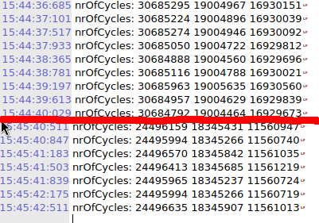
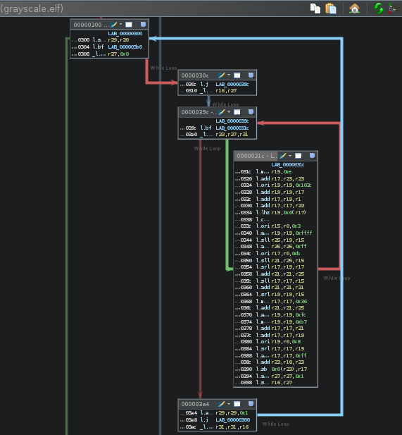
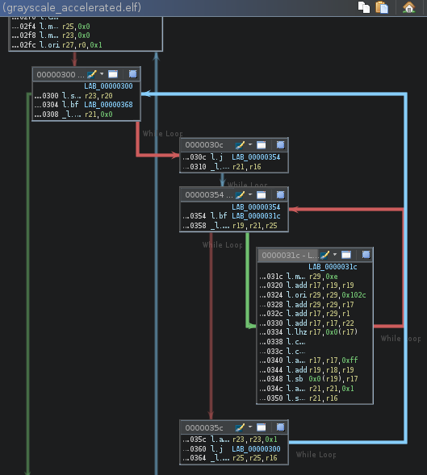

Part 2 of PW2

A new module implementing the custom instruction was created in ./modules/to_grayscale/toGrayscale.v. It implements the required transformation by replacing multiplications with shifts and adds, like you do on paper with partial products.

As1: The original variant needed 30.6 M cpu cycles, 19 M of which the CPU was stalled and ~17 M the bus was idle.

As2: A new executable was created under .programs/grayscale_accelerated to use this custom instruction.

As3: The elapsed cycles dropped to 24.5 M, 18.3 M stalled and for 11.5 M the bus was idle.

As4: You can see a comparison below:


The camera takes pictures with a resolution of 640 * 480 = 307200 pixels, and the program processes each of them inside 2 nested loops, the outer for line, the inner for column.

Disassembling the original program we can see the inner loop executing 33 instructions, most of them adds and shifts.


The accelerated version, however, has 17 instructions less, those arithmetic and logic needed to convert to grayscale.


Assuming 1 instruction per cycle it saves 17 * 640 * 480 = 5222400 fetches, decodes and executes. Comparing the numbers above 30.6 M - 24.5 M is indeed around 5 M. The stalled count didn't drop that much because adds and shifts execute in 1CC, and the bus is idle when the CPU does math (it does not read any data from DRAM or camera), and the same 5M CC difference is observed.


=========================OLD README BELOW=============================
#### Structure:

The virtual prototype consists of three directories:

- modules: This directory contains the several modules that are contained in the SOC. Add your own modules in this directory. Most modules also contain a ```doc``` directory with documentation.
- programms: This directory contains the "hello world" template that can be used as basis for your own programms.
- systems: This directory contains all the required files for the "top level" of the SOC.

#### Hardware configuration files:

To be able to build the Virtual Prototype hardware, there are several files:

- systems/singleCore/scripts/gecko4_or1420.tcl: This file contains the pin-mapping of the top level to the FPGA-pins. For the add-on board they are already contained as remarks, for the one's of the GECKO4Education you can visit [the wiki page](https://gecko-wiki.ti.bfh.ch/gecko4education_epfl:start).
- systems/singleCore/config/project.device.intel: This file contains the definitions of the FPGA used on the GECKO4Education. Do not modify this file.
- systems/singleCore/config/project.files: This file contains a list with all Verilog files that are required to build the Virtual Prototype. If you add modules, you have also to modify this file such that the modules are found.
- systems/singleCore/config/project.intel: This file contains generic commands for the Intel Quartus Lite tool. Do not modify this file.
- systems/singleCore/config/project.qsf: This file is responsible to include the gecko4_or1420.tcl file. Do not modify this file.
- systems/singleCore/config/project.toplevel: This file contains the name of the top-level module. Normally you should not have to modify this file.

#### Building the hardware:

As the tools are quite "heavy" and to provide a automated flow, a makefile system is used. To build the system:

- Goto the directory systems/singleCore/ (e.g. ```cd systems/singleCore/```).
- Type: ```make intel_bit```
- If no errors occurred you'll find in the directory ```systems/singleCore/sandbox``` the files ```or1420SingleCore.cfg``` and ```or1420SingleCore.rbf```. These files can be used to program your FPGA with the open-source tool ```openocd``` of the oss-cad-suite by executing ```openocd -f or1420SingleCore.cfg``` on the machine to which the GECKO4Education board is connected. Alternatively you can use the intel quartus programmer, for this you require the file ```or1420SingleCore.sof```, which is also available in the directory ```systems/singleCore/sandbox```

#### Building the software:

Also the software is based on a makefile system. To build a program follow following steps (with as example the hello world program):

- Goto the directory ```programms/helloWorld```
- Execute ```make clean mem```
- If no error occurred, you will find in the directory ```programms/helloWorld/build-release/``` the files ```hello.elf```, ```hello.cmem```, and ```hello.mem```. The file that you need to upload to your board is the ```hello.cmem```-file.
- Upload the ```hello.cmem```-file with your favorite terminal program to your virtual prototype.

IMPORTANT: As the or1420 does not contain a hardware-divide unit you have to compile your programm with the compile option ```-msoft-div```!
